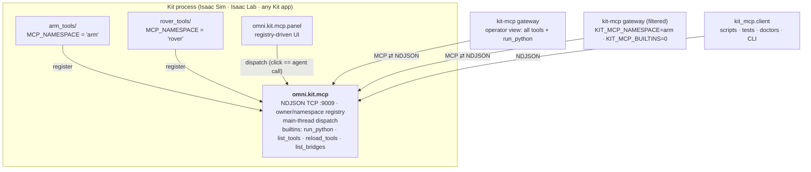

# omni-kit-mcp

Infrastructure for driving **Omniverse Kit** apps — Isaac Sim, Isaac Lab, or
any Kit-based app — over the **Model Context Protocol**.

**One bridge, one port, per Kit process.** Projects register tools under a
namespace; name collisions between projects are impossible by construction
(two projects can each ship a `play_scene` — they land as `arm.play_scene`
and `rover.play_scene`), so co-loaded projects share the single socket.



## Setup (once per machine)

Register the bridge permanently (afterwards, launches need no flags or env
vars):

```bash
python3 scripts/install.py            # add --dry-run to preview
```

This edits the Kit app's persistent `user.config.json` (the scriptable
equivalent of the Extensions window's AUTOLOAD checkbox): adds `exts/` as a
search path, auto-enables `omni.kit.mcp` + `omni.kit.mcp.panel`, and sets the
bridge port (default **9009**). Restart the app; the bridge binds with the
built-in tools. `--remove` undoes it.

Connect an agent/IDE — install the front-end (`pip install -e .` or `uv sync`)
and add to `.mcp.json` (Claude Code, Cursor, etc.):

```json
{
  "mcpServers": {
    "kit": { "command": "kit-mcp" }
  }
}
```

No port needed — the gateway discovers a lone running bridge. Pin one with
`"env": { "OMNI_KIT_MCP_PORT": "9009" }` when several Kit processes run.

That alone is fully usable: `run_python` executes arbitrary Python on Kit's
main thread (persistent sessions supported), which reaches everything in the
sim. Tools discovered from the bridge appear as native MCP tools
(`robot_demo.spawn_robot` → `robot_demo__spawn_robot`; dots are illegal in MCP names).

## Adding a project (the contract)

A project is a **plain Python package** — not a Kit extension. It declares a
namespace and exposes one entrypoint (copy `examples/demo_tools/`):

```python
# ~/myproj/isaac/myproj_tools/__init__.py
MCP_NAMESPACE = "robot_demo"                       # defaults to the module name

def register(registrar):                   # receives an owner-bound registrar
    @registrar.tool("Spawn a robot into the scene.", {"name": {"type": "string"}})
    def spawn_robot(name: str = "robot_1"):
        import omni.usd                    # Kit imports live inside handlers
        ...
        return {"path": f"/World/{name}"}  # payload only — no envelope
```

Register it persistently (once per project):

```bash
python3 scripts/install.py add-project --path ~/myproj/isaac --module myproj_tools
```

Next launch, the bridge advertises `robot_demo.spawn_robot`; the panel grows a `robot_demo`
section; agents see it after `refresh_tools`. Per-launch override instead of
persistence: `KIT_MCP_TOOL_PATHS=~/myproj/isaac KIT_MCP_TOOL_MODULES=myproj_tools`.

> **One registration, three surfaces.** A registered tool isn't just an agent
> verb: the control panel renders it as a clickable widget automatically, and
> the reference client/CLI can call it from scripts — all three go through the
> same dispatch entrance. Write the tool once; button, agent call, and script
> call come with it.

Handler contract: params arrive as kwargs; return a JSON-serializable payload
(`None` → `{}`) or raise (`ToolError` attaches diagnostics like captured
stdout). Sync or async. The bridge owns the envelope and the main-thread hop.

**Curated per-project agent views** — same binary, same socket, different env:

```json
"robot-demo-agent": {
  "command": "kit-mcp",
  "env": { "OMNI_KIT_MCP_PORT": "9009",
           "KIT_MCP_NAMESPACE": "robot_demo",
           "KIT_MCP_BUILTINS": "0" }
}
```

exposes only `robot_demo.*` — no `run_python` — for agents that should stay on the
stable API. `run_python` is the operator's escape hatch and how tools are
prototyped; registered tools are what agents rely on.

## Scripting the bridge (no MCP needed)

The bridge's wire protocol is not MCP — the gateway above is the only MCP
speaker. For scripts, tests, and health checks, use the **reference client**
(stdlib-only, single-file, also copyable as-is):

```python
from kit_mcp.client import call, BridgeClient, BridgeError
call("demo.ping", {"message": "hi"})                 # one-shot; port auto-discovered
with BridgeClient() as c:                            # persistent + reconnect
    c.call("run_python", {"code": "result = 1"})     # (pass port=... to pin)
```

```bash
python3 -m kit_mcp.client <tool> ['{"json":"params"}'] [--port N]
python3 -m kit_mcp.client --list-bridges          # what's running
# exit codes: 0 success · 1 bridge answered with an error · 2 unreachable
```

**Port resolution — you usually don't specify one.** Each running bridge
advertises itself in a per-user runtime dir (`$XDG_RUNTIME_DIR/omni-kit-mcp/`).
A client resolves its port as: explicit `port=`/`--port` → `OMNI_KIT_MCP_PORT`
→ **auto-discovered when exactly one bridge is running** → a loud error listing
candidates when several are (e.g. the app on 9009 *and* a Lab run on 9010 — then
name one). The single-process common case is zero-config; only genuinely
ambiguous multi-process boxes ever need a port. (Agents via the gateway are
even simpler — the gateway resolves once at startup and they just call tools.)

`import kit_mcp.client` works without the `mcp` SDK installed — only the
gateway needs it.

## Hot reload

Edit tool code, then (via any client): `reload_tools {"module": "myproj_tools"}`
→ the owner drains in-flight work, the module tree re-imports (stale bytecode
purged), tools re-register. Live handles that must survive (articulation
views, physics handles) belong in a submodule named `*_state` — state modules
are preserved across reloads. Then `refresh_tools` on the MCP front-end picks
up schema changes. No Kit restart.

## Control panel

`omni.kit.mcp.panel` renders the live registry: one section per namespace,
parameter widgets generated from each tool's schema. Every button goes through
`bridge.dispatch(...)` — the same entrance a socket request takes — so a human
click and an agent call are the same code path by construction. Projects that
want bespoke UI ship a thin widgets-only extension obeying the same rule.

## Wire protocol (NDJSON over TCP)

One JSON object per `\n`-terminated line, each direction:

```
→ {"type": "robot_demo.spawn_robot", "params": {"name": "robot_1"}}
← {"status": "success", "result": {"path": "/World/robot_1"}}
← {"status": "error", "message": "...", "traceback": "...", ...}
→ {"type": "list_tools", "params": {}}
← {"status": "success", "result": {"tools": {"robot_demo.spawn_robot": {"description": ..., "parameters": ..., "namespace": "robot_demo", "owner_id": ...}}}}
```

A malformed line gets one error response; the connection stays healthy. Many
clients may hold connections concurrently; each is isolated. Tool execution is
serialized on Kit's main thread (USD/PhysX are not thread-safe).

## Configuration reference

| Knob | Persistent (carb setting under `/persistent/exts/omni.kit.mcp/`) | Per-launch env override |
|---|---|---|
| Bridge port | `autostartPort` | `OMNI_KIT_MCP_PORT` |
| Bind address | `autostartHost` | `OMNI_KIT_MCP_BIND` |
| Tool packages | `toolModules` | `KIT_MCP_TOOL_MODULES` |
| Package paths | `toolPaths` | `KIT_MCP_TOOL_PATHS` |

**Remote access.** The bridge binds `localhost` by default — it serves
`run_python` (remote code execution by design), so listening beyond loopback
is an explicit per-box decision. Options: an SSH tunnel (zero config), or set
the bind address to a private/tailnet IP (`install.py --bind-host <ip>`;
never `0.0.0.0` on a public host). Remote callers can't read the box's
portfiles, so the `list_bridges` builtin exists: ask any reachable bridge
(typically the stable installed-app port) and it reports every bridge on its
box — including ephemeral-port siblings.

Front-end (`kit-mcp`) env: `OMNI_KIT_MCP_PORT` (optional — auto-discovered
when exactly one bridge runs; set it to pin a process), `OMNI_KIT_MCP_HOST`,
`KIT_MCP_NAMESPACE` (comma allowlist), `KIT_MCP_BUILTINS` (`0` hides
`run_python`/`reload_tools`), `KIT_MCP_NAME` / `KIT_MCP_INSTRUCTIONS`.

## Isaac Lab (standalone scripts)

The bridge's only Kit dependency (`omni.kit.async_engine`) ships in Kit's core
extension set, so it runs in any Kit app — including Isaac Lab. Lab
*standalone scripts* (train/play) differ from the Isaac Sim app in three ways:
the script owns the Kit app (`AppLauncher` + Lab's own `isaaclab.python.*.kit`
experiences), so persistent registration doesn't apply — enable the bridge
per-script via `--kit_args`; the script owns the main loop, so bridge commands
execute only while the app is pumped (`env.step()` / `sim.step()`) — a script
blocked between steps stalls dispatch until the next pump; and configuration
is env-var only. Note the port: "one bridge, one port, *per Kit process*" —
a Lab standalone run is its own Kit process, so when it runs alongside the
installed app (which holds 9009) it needs its own port (9010 by convention).
See `examples/isaaclab_bridge_launch.py` for the template.

## Layout

```
exts/omni.kit.mcp/          the bridge extension (protocol, bridge, builtins, autoload)
exts/omni.kit.mcp.panel/    registry-driven control panel (optional)
kit_mcp/                    the MCP front-end (FastMCP server, TCP client to the bridge)
scripts/install.py          permanent registration: base install + add-project
examples/demo_tools/        the template tool package — copy to onboard a project
tests/                      protocol / registry / autoload / live-socket tests (no Kit needed)
```

## Development

```bash
python3 -m pytest tests/    # the socket server runs under plain asyncio in tests
```
